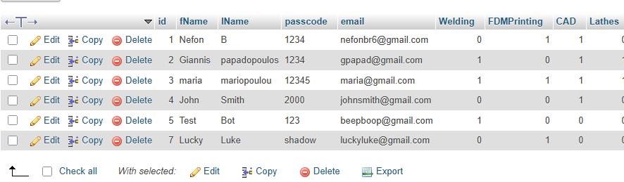

# EmployeeTaskAssignmentWebsite
An html website utilizing mysql and php to store,retrieve and display Employee Data, Task Data and allow users to choose their next task filtering for capabilities.

Built for 6006-Τεχνολογία Διαδικτύου στην Ψηφιακή Βιομηχανία at UNIWA | Industrial Design and Production Engineers Division by 23389209

## **Σενάριο και Εισαγωγή**

Η συγκεκριμενη εφαρμογή θα μπορούσε να τροποποιηθεί πολύ έυκολα για οποιαδήποτε εταιρεία αλλά δημιουργήθηκε συγκεκριμένα για μια εταιρεία μηχανικών. Επιχειρεί να οργανώσει και να αυτοματοποιήσει την καταγραφή δεδομένων των υπαλλήλων όπως όνομα, email και τις ικανότητες με τις οποίες μπορούν να συνεισφέρουν στην εργασία της επιχείρησης. Ταυτόχρονα καταγράφει τις εργασίες που πρέπει να πραγματοποιηθούν, εως πότε πρέπει να είναι έτοιμες και τι ικανότητες αυτές απαιτούν. 

Ένας υπάλληλος έχει πρόσβαση σε όλα αυτά τα δεδομένα επιτρέποντας του να επικοινωνήσει με του συνεργάτες του εύκολα και να αναλάβει όποια task επιθυμεί και είναι ικανός να πραγματοποιήσει. Προωθεί την αυτονομία των υπαλλήλων και την αίσθηση συνεργασίας στην επιχείρηση και επιτρέπει στους υπαλλήλους να έχουν μια ελευθερία στις εργασίες που πραγματοποιούν ώστε να επιλέγουν αυτές που προτιμούν.

---

## Αρχιτεκτονική και δομή βάσης δεδομένων

Η εφαρμογή αναπτύχθηκε με VS Code κάνωντας χρήση xampp και συγκεκριμένα apache και mySQL(php myadmin interface)

Από άποψη mySQL αποτελείται από δύο πίνακες

Ο πρώτος πίνακας employeeinfo περιλαμβάνει τις πληροφορίες των υπαλλήλων και έχει την παρακάτω μορφή:

Ο δεύτερος πίνακας job info περιλαμβάνει τις απαραίτητες πληροφορίες για τις εργασίες. Σημείωνεται ότι έδω capabilities όπως welding αποτυπώνουν την απαίτηση γνώσης για να αναλάβει ένας υπάλληλοςτην εργασία

Η εφαρμογή έχει 4 βασικές λειτουργικές σελίδες

Όλες οι σελίδες έχουν κοινή την link bar που χρησιμοποιείται για την πλοήγηση στην εφαρμογή δίνοντας εύκολη πρόσβαση σε όλες τις σελίδες που απαιτούνται.

Κώδικας δημιουργίας της link bar

H πρώτη σελίδα αποτυπώνει σε πίνακα τα χαρακτηριστικά των υπαλλήλων( εκτός του passcode για προφανείς λόγους)

Οι πληροφορίες γράφονται στον πίνακα με παρόμοιο τρόπο που γράφονται στο πίνακα εργασίων ο οποίος επιδεικνύεται αργότερα

Όπως και κάθε σελίδα που απαιτεί σύνδεση με database πρέπει να έχει τον παρακάτω κώδικα για διαχείριση της σύνδεσης.

Η δεύτερη σελίδα καταγράφει σε πίνακα τις εργασίες που πρέπει να ολοκληρωθούν και τις σχετικές πληροφορίες που χρειάζεται κάποιος για να τις αναλάβει. Καραγράφει επίσης αν κάποιος την έχει αναλάβει και ποιός είναι καθώς και τις απαιτήσεις.

Κάτω από τον πίνακα υπάρχει φόρμα εισαγωγής η οποία επιτρέπει την επιλογή εργασίων μετά από έλεγχο για τις ικανότητες του υπαλλήλου. Αν κάποια από τις προυποθέσει δεν πληρείται αρνείται και εμφανίζει το μήνυμα σφάλματος που φάινεται στην δέυτερη εικόνα

Ο κώδικας που χρησιμοποιείται για την εισαγωγή δεδομένων στον πίνακα. Παρόμοιος πίνακας χρησιμοποιήθηκε και στο employeeinfo Table.

Και ο κώδικας που χρησιμοποιείται για τον έλεγχο λογικής στα capabilities.

Η τρίτη και η τέταρτη σελίδα είναι φόρμες εισαγωγής καινούριων δεδομένων στους πινακες employee info και job info. Έχουν άμεση σύνδεση με το database και ανεβάζουν κατευθείαν τα δεδομένα τους στην σωστή θέση

Ο κώδικας μορφοποίησης και εισαγωγής των δεδομένων στην sql database

Δημιουργία φόρμας εισαγωγής δεδομένων στο html

## Διαδικασία ανάπτυξης εφαρμογής

Η εφαρμογή αναπτύχθηκε με την υιοθέτηση μια προσέγγισης από κάτω προς τα πάνω. Πρώτα σε επίπεδο σχεδιασμού καθορίστηκε το εύρος της εφαρμογής και ο τρόπος υλοποίησης των απαραίτητων λειτουργίων. Ύστερα δημιουργήθηκαν οι κατάλληλοι πίνακες sql και μόνο τότε άρχισε η δημιουργία του html ιστότοπου. Το html αναπτύχθηκε βαθμίαια, πρώτα με την εισαγωγή δεδομένων στο database, μετά με την προβολή τους σε πίνακες, μετά με την λογική και τέλος μόνο με την αισθητική και την μορφή της ιστοσελίδας. Το τελευταίο βήμα ήταν η ανάπτυξη της δικτύωσης στο cisco packet tracer.

## Δικτύωση

Η τοπολογία του δικτύου στο cisco packet tracer έχει την εξής μορφή

Πρόσβαση στον ιστότοπο του project από το PC0 το οπόιο είναι σε διαφορετικό δίκτυο από του server. Φυσικά η ιστοσελίδα δεν είναι πλήρως λειτουργική καθώς οι προσωμοιομέονοι υπολογιστές του cisco packet tracer είναι πολύ απλοϊκοί και δεν περιλάμβανουν mysql.

Αποτέλεσμα ping και tracert από το PC0 στην ip του server. To ping επιδεικνύει την συνδεσιμότητα και το tracert την χρήση των router και των διαφορετικών network

show ip route σε ένα από τα router επιδεικνύοντας την επιτυχή χρήση του προτόκολου OSPF

